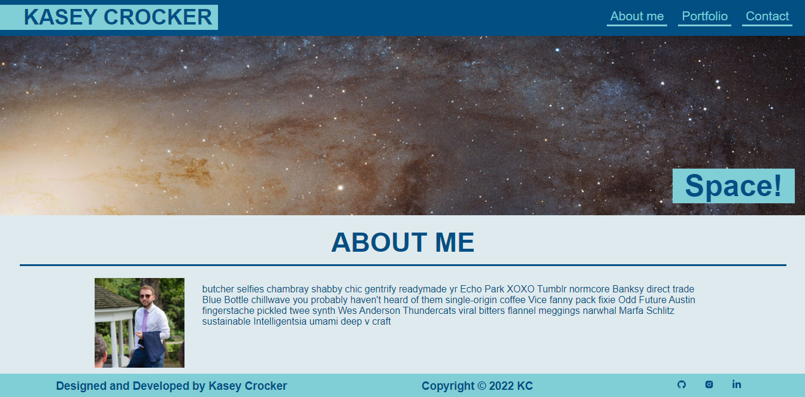

<h2 align="center">
  Portfolio Website  
  <a href="https://kaseycrocker.github.io/portfolio/" target="_blank">kaseycrocker.github.io/portfolio</a>
 </h2>
 

  

## Purpose
A website that shows a portfolio of what I have created as a web developer.

## Built with
- [React](https://reactjs.org/)
- [Node.js](https://nodejs.org/en/)
- CSS3
- VsCode

## Isntallation
You'll need `node.js` and `git` installed on your machine.
  1. Run `npm install` in your terminal
  2. Run `npm start` in the root directory of the file.
  
  
